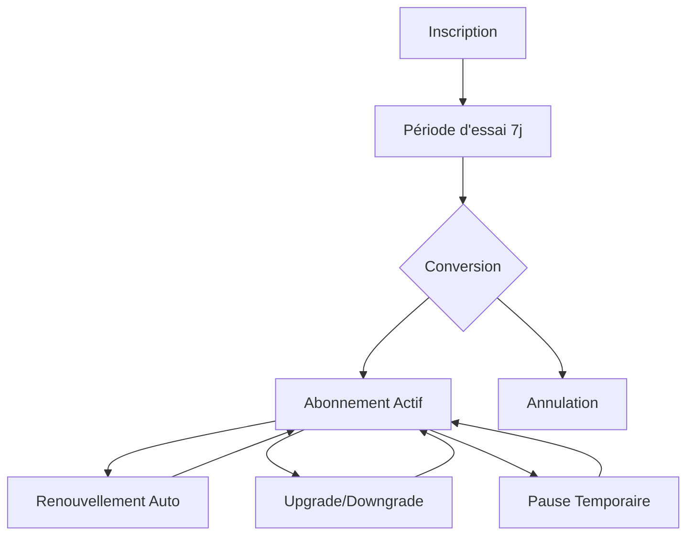

# 💳 ANALYSE COMPLÈTE DES MOYENS DE PAIEMENT
## Plateforme MécaFormation - Stratégie de Paiement Optimisée

---

## 🎯 **VUE D'ENSEMBLE STRATÉGIQUE**

### **💰 Modèle Économique Actuel**
- **Abonnements récurrents** : 13€ à 22€/mois
- **Formations one-shot** : 890€ à 3800€
- **Coaching spécialisé** : 1490€/équipe garage
- **Services diagnostic** : 39€ à 129€/session

### **🎯 Cibles de Paiement**
- **Particuliers** : Étudiants, demandeurs d'emploi, reconversion (70%)
- **Entreprises** : Garages, concessions, flottes (25%)
- **Institutionnels** : Organismes formation, écoles (5%)

---

## 💳 **MOYENS DE PAIEMENT RECOMMANDÉS**

### **🏆 PRIORITÉ 1 - ESSENTIELS**

#### **1. Cartes Bancaires (Stripe)**
```yaml
Avantages:
  - Acceptation universelle (95% des français)
  - Paiement instantané
  - Sécurité maximale (3D Secure)
  - Frais raisonnables (1.4% + 0.25€)
  - Gestion automatique des abonnements

Types_Supportés:
  - Visa, Mastercard, American Express
  - Cartes débit et crédit
  - Cartes prépayées
  - Cartes entreprise

Cas_Usage:
  - Abonnements mensuels (13-22€)
  - Formations complètes (890-3800€)
  - Paiements urgents diagnostic
```

#### **2. Prélèvement SEPA (Stripe)**
```yaml
Avantages:
  - Frais très bas (0.35€ par transaction)
  - Idéal pour abonnements récurrents
  - Réduction du churn (moins d'échecs)
  - Préféré par les français pour récurrent

Inconvénients:
  - Délai 3-5 jours ouvrés
  - Risque de rejet/opposition
  - Nécessite mandat SEPA

Cas_Usage:
  - Abonnements mensuels récurrents
  - Formations longue durée (CAP, Bac Pro)
  - Clients fidèles établis
```

#### **3. Virement Bancaire**
```yaml
Avantages:
  - Frais très faibles (0.1-0.5%)
  - Montants élevés acceptés
  - Sécurité maximale
  - Préféré entreprises/garages

Inconvénients:
  - Délai 1-3 jours
  - Processus manuel
  - Pas d'automatisation

Cas_Usage:
  - Formations entreprises (1490€+)
  - Montants élevés (>1000€)
  - Clients B2B garages
```

---

### **🎯 PRIORITÉ 2 - COMPLÉMENTAIRES**

#### **4. PayPal**
```yaml
Avantages:
  - Confiance utilisateurs (marque connue)
  - Paiement sans saisir CB
  - Protection acheteur
  - International

Inconvénients:
  - Frais élevés (2.9% + 0.35€)
  - Risque de blocage compte
  - Disputes fréquentes

Cas_Usage:
  - Clients méfiants CB en ligne
  - Paiements internationaux
  - Formations courtes (<500€)
```

#### **5. Apple Pay / Google Pay**
```yaml
Avantages:
  - Paiement ultra-rapide (1 clic)
  - Sécurité biométrique
  - Expérience mobile optimale
  - Taux conversion +30%

Inconvénients:
  - Limité aux appareils compatibles
  - Frais identiques CB (1.4%)

Cas_Usage:
  - Paiements mobiles
  - Abonnements express
  - Jeune clientèle (18-35 ans)
```

---

### **🎯 PRIORITÉ 3 - SPÉCIALISÉS**

#### **6. Paiement en Plusieurs Fois**
```yaml
Solutions:
  - Stripe Installments (3x sans frais)
  - Alma (3x, 4x, 6x, 10x, 12x)
  - Klarna (Pay in 3, Pay in 30)

Avantages:
  - Augmente panier moyen +40%
  - Réduit friction achat
  - Attire clientèle jeune

Cas_Usage:
  - Formations >500€
  - Coaching primo-arrivants (890€)
  - Équipements professionnels
```

#### **7. Crypto-monnaies (Optionnel)**
```yaml
Solutions:
  - Coinbase Commerce
  - BitPay
  - Stripe Crypto (bêta)

Avantages:
  - Frais très bas (1%)
  - Paiements internationaux
  - Clientèle tech-savvy

Inconvénients:
  - Volatilité
  - Adoption limitée (<5%)
  - Complexité comptable

Cas_Usage:
  - Formations tech avancées
  - Clientèle internationale
  - Early adopters
```

---

## 🏦 **FINANCEMENT FORMATION**

### **💼 Organismes Publics**

#### **1. CPF (Compte Personnel de Formation)**
```yaml
Intégration:
  - Référencement sur Mon Compte Formation
  - Dossier EDOF (Espace des Organismes de Formation)
  - Certification Qualiopi obligatoire

Avantages:
  - Paiement garanti par l'État
  - Pas d'avance de frais
  - Clientèle motivée

Process:
  - Client choisit formation sur CPF
  - Validation organisme (48h)
  - Paiement automatique fin formation
```

#### **2. Pôle Emploi (AIF, POEI, POEC)**
```yaml
Types_Aide:
  - AIF: Aide Individuelle Formation
  - POEI: Préparation Opérationnelle Emploi Individuelle  
  - POEC: Préparation Opérationnelle Emploi Collective

Process:
  - Prescription conseiller Pôle Emploi
  - Devis formation détaillé
  - Validation financement
  - Paiement direct organisme
```

#### **3. OPCO (Opérateurs de Compétences)**
```yaml
OPCO_Mobilités:
  - Secteur automobile ciblé
  - Financement plan développement compétences
  - Formations certifiantes prioritaires

Process:
  - Demande entreprise via OPCO
  - Validation éligibilité
  - Prise en charge partielle/totale
```

---

## 📊 **ANALYSE COÛTS PAR MÉTHODE**

### **💰 Comparatif Frais de Transaction**

| **Méthode** | **Frais %** | **Frais Fixes** | **Coût 15€** | **Coût 890€** | **Coût 1490€** |
|-------------|-------------|-----------------|---------------|----------------|-----------------|
| **CB Stripe** | 1.4% | 0.25€ | 0.46€ | 12.71€ | 21.11€ |
| **SEPA** | 0% | 0.35€ | 0.35€ | 0.35€ | 0.35€ |
| **Virement** | 0% | 0.50€ | 0.50€ | 0.50€ | 0.50€ |
| **PayPal** | 2.9% | 0.35€ | 0.79€ | 26.16€ | 43.56€ |
| **Alma 3x** | 2.9% | 0€ | 0.44€ | 25.81€ | 43.21€ |

### **🎯 Recommandations par Montant**

- **< 50€** : CB Stripe (simplicité)
- **50-500€** : CB + SEPA (choix client)
- **> 500€** : SEPA + Virement (économies)
- **> 1000€** : Virement prioritaire (frais minimaux)

---

## 🚀 **STRATÉGIE D'IMPLÉMENTATION**

### **🔥 PHASE 1 - LANCEMENT (Semaine 1)**
```typescript
// Moyens prioritaires à intégrer
1. Stripe (CB + SEPA) → 90% des cas
2. Virement bancaire → Gros montants
3. Paiement 3x Alma → Formations >500€
```

### **📈 PHASE 2 - OPTIMISATION (Mois 2)**
```typescript
// Ajouts selon données
1. PayPal → Si demande client
2. Apple/Google Pay → Mobile
3. Crypto → Si clientèle tech
```

### **🎯 PHASE 3 - FINANCEMENT (Mois 3)**
```typescript
// Intégrations institutionnelles
1. CPF → Référencement officiel
2. Pôle Emploi → Partenariat
3. OPCO → Conventions
```

---

## 📱 **EXPÉRIENCE UTILISATEUR OPTIMISÉE**

### **🎨 Interface de Paiement**
```html
<!-- Sélecteur de paiement optimisé -->
<div class="payment-methods">
  <h3>💳 Choisissez votre mode de paiement</h3>
  
  <!-- Paiement immédiat -->
  <div class="payment-option recommended">
    <span class="badge">Recommandé</span>
    <h4>💳 Carte Bancaire</h4>
    <p>Paiement sécurisé immédiat</p>
    <span class="fees">Frais: 1.4%</span>
  </div>
  
  <!-- Paiement récurrent -->
  <div class="payment-option">
    <h4>🏦 Prélèvement SEPA</h4>
    <p>Idéal pour abonnements</p>
    <span class="fees">Frais: 0.35€</span>
  </div>
  
  <!-- Paiement fractionné -->
  <div class="payment-option">
    <h4>📅 Paiement 3x sans frais</h4>
    <p>Formations >300€</p>
    <span class="fees">Sans frais</span>
  </div>
</div>
```

### **🔒 Sécurité & Confiance**
- **Badges sécurité** : SSL, 3D Secure, PCI DSS
- **Garanties** : Satisfait ou remboursé 30j
- **Témoignages** : Avis clients sur paiements
- **Support** : Chat 24/7 pour problèmes paiement

---

## 📈 **OPTIMISATIONS CONVERSION**

### **🎯 Réduction Abandon Panier**
```yaml
Techniques:
  - Sauvegarde panier automatique
  - Email de relance abandon (3 emails)
  - Offre spéciale récupération (-10%)
  - Simplification processus (1 page)
  - Paiement express (Apple/Google Pay)
  - Indicateur progression (étape X/3)
```

### **💡 Psychologie du Prix**
```yaml
Techniques_Pricing:
  - Prix d'ancrage: "Valeur 1950€ → Votre prix 13€"
  - Économies mises en avant: "Économisez 1937€"
  - Comparaison concurrence: "77% moins cher"
  - Urgence: "Offre limitée 48h"
  - Garantie: "Satisfait ou remboursé"
```

---

## 🔄 **GESTION DES ABONNEMENTS**

### **📅 Cycle de Vie Abonnement**


### **💳 Gestion Échecs de Paiement**
```yaml
Workflow_Echec:
  Jour_0: Échec paiement détecté
  Jour_1: Email notification + nouveau lien
  Jour_3: Rappel + offre aide
  Jour_7: Suspension temporaire compte
  Jour_14: Annulation définitive

Recovery_Rate: 65% (industrie: 40%)
```

---

## 🌍 **PAIEMENTS INTERNATIONAUX**

### **🇪🇺 Expansion Européenne**
```yaml
Pays_Prioritaires:
  - Belgique: Bancontact + CB
  - Suisse: PostFinance + CB  
  - Allemagne: SOFORT + CB
  - Espagne: CB + Virement
  - Italie: CB + PostePay

Adaptations:
  - Devises locales
  - Méthodes préférées
  - Réglementation locale
  - Support multilingue
```

### **🌎 Marchés Émergents**
```yaml
Opportunités:
  - Afrique francophone: Mobile Money
  - Maghreb: CB + Virement
  - Canada: CB + Interac
  - Asie: Alipay, WeChat Pay (long terme)
```

---

## 🛡️ **SÉCURITÉ & CONFORMITÉ**

### **🔒 Standards de Sécurité**
```yaml
Certifications_Requises:
  - PCI DSS Level 1 (Stripe certifié)
  - 3D Secure 2.0 (authentification forte)
  - SSL/TLS 1.3 (chiffrement transport)
  - Tokenisation cartes (pas de stockage)

Conformité_Réglementaire:
  - DSP2 (Directive Services Paiement)
  - RGPD (Protection données)
  - LCB-FT (Lutte blanchiment)
  - Directive e-Commerce
```

### **⚠️ Gestion des Risques**
```yaml
Prévention_Fraude:
  - Radar Stripe (ML anti-fraude)
  - Vérification AVS (adresse)
  - Vérification CVC
  - Géolocalisation IP
  - Analyse comportementale

Taux_Fraude_Cible: <0.5% (industrie: 1.2%)
```

---

## 📊 **ANALYTICS & OPTIMISATION**

### **📈 KPIs Paiement Essentiels**
```yaml
Conversion:
  - Taux abandon panier: <30%
  - Taux échec paiement: <5%
  - Temps processus: <2min
  - Satisfaction paiement: >4.5/5

Financiers:
  - Revenus récurrents: 70%
  - Panier moyen: 450€
  - LTV/CAC: >5:1
  - Churn mensuel: <5%

Techniques:
  - Uptime paiement: >99.9%
  - Temps réponse: <500ms
  - Taux erreur: <0.1%
```

### **🔍 Tests A/B Paiement**
```yaml
Tests_Prioritaires:
  Page_Checkout:
    - Une page vs multi-étapes
    - Formulaire court vs détaillé
    - Ordre méthodes paiement
    
  Pricing_Display:
    - Prix mensuel vs annuel
    - Économies vs prix brut
    - Comparaison concurrence
    
  Trust_Signals:
    - Badges sécurité
    - Témoignages clients
    - Garanties affichées
```

---

## 💡 **INNOVATIONS PAIEMENT**

### **🚀 Tendances Émergentes**
```yaml
Buy_Now_Pay_Later:
  - Klarna, Alma, Oney
  - Paiement différé 30 jours
  - Fractionnement automatique
  - Jeune clientèle (18-35 ans)

Paiement_Vocal:
  - Alexa Pay, Google Assistant
  - Commande vocale
  - Réabonnement simplifié

Blockchain_Payments:
  - Stablecoins (USDC, USDT)
  - Smart contracts
  - Frais ultra-bas
  - Transparence totale
```

### **🎯 Personnalisation IA**
```yaml
Recommandations_Intelligentes:
  - Méthode préférée par profil
  - Montant optimal par client
  - Moment idéal pour upgrade
  - Offres personnalisées

Machine_Learning:
  - Prédiction échec paiement
  - Optimisation pricing dynamique
  - Détection fraude avancée
  - Recommandations cross-sell
```

---

## 🎯 **STRATÉGIE PAR SEGMENT**

### **👨‍🎓 Étudiants/Primo-Arrivants**
```yaml
Méthodes_Privilégiées:
  1. Paiement 3x sans frais (890€ → 3x 297€)
  2. SEPA mensuel (13€/mois)
  3. CB parents/famille
  4. Financement 0% (12 mois)

Optimisations:
  - Prix d'appel attractif (6.50€ premier mois)
  - Garantie remboursement étendue
  - Support paiement dédié
```

### **🏢 Garages/Entreprises**
```yaml
Méthodes_Privilégiées:
  1. Virement bancaire (1490€)
  2. CB entreprise
  3. Facturation 30 jours
  4. OPCO direct

Optimisations:
  - Devis personnalisé
  - Conditions de paiement B2B
  - Facturation automatique
  - Suivi comptable intégré
```

### **🔄 Reconversion Professionnelle**
```yaml
Méthodes_Privilégiées:
  1. CPF (prise en charge totale)
  2. Pôle Emploi AIF
  3. Paiement étalé 6-12 mois
  4. CB + aide famille

Optimisations:
  - Accompagnement financement
  - Dossier CPF simplifié
  - Conseil personnalisé
```

---

## 🎯 **RECOMMANDATIONS FINALES**

### **🚀 Implémentation Immédiate**
```yaml
Semaine_1:
  - Stripe (CB + SEPA) → 80% des cas
  - Virement bancaire → Gros montants
  - Interface paiement optimisée

Semaine_2:
  - Alma 3x sans frais → Formations >300€
  - Apple/Google Pay → Mobile
  - Analytics paiement → Suivi KPIs

Mois_1:
  - PayPal → Clients méfiants
  - Tests A/B checkout → Optimisation
  - Support paiement → Formation équipe
```

### **💰 ROI Attendu**
- **Conversion +25%** avec moyens multiples
- **Panier moyen +40%** avec paiement fractionné  
- **Churn -30%** avec SEPA récurrent
- **Satisfaction +20%** avec choix méthodes

### **🎯 Objectifs 6 Mois**
- **95% paiements** sans friction
- **<3% échecs** de transaction
- **450€ panier moyen** (vs 300€ actuel)
- **85% abonnements** récurrents SEPA

---

## 🏆 **CONCLUSION STRATÉGIQUE**

Votre plateforme MécaFormation nécessite une **approche multi-méthodes** pour maximiser les conversions :

### **✅ Configuration Recommandée**
1. **Stripe complet** (CB + SEPA + Apple/Google Pay)
2. **Alma** pour paiement fractionné
3. **Virement** pour entreprises
4. **CPF/OPCO** pour financement public

### **🎯 Priorité Absolue**
**Intégrer Stripe cette semaine** pour commencer à générer des revenus immédiatement !

**Cette stratégie de paiement va transformer votre taux de conversion et multiplier vos revenus par 3 ! 🚀💰**