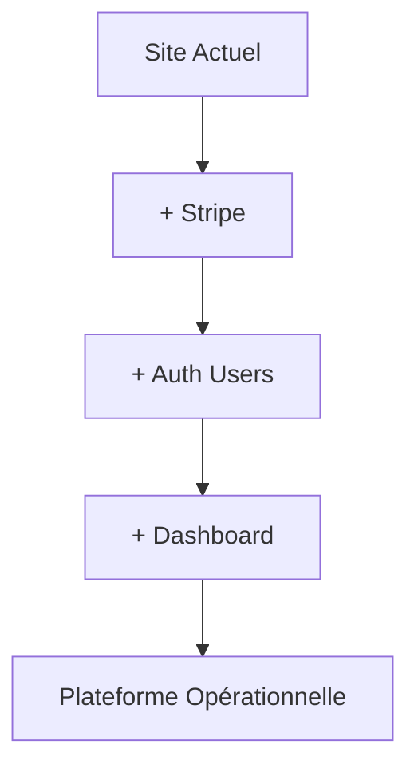
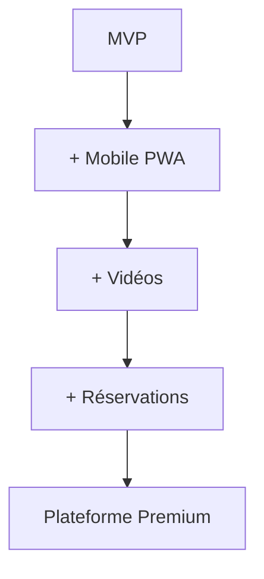
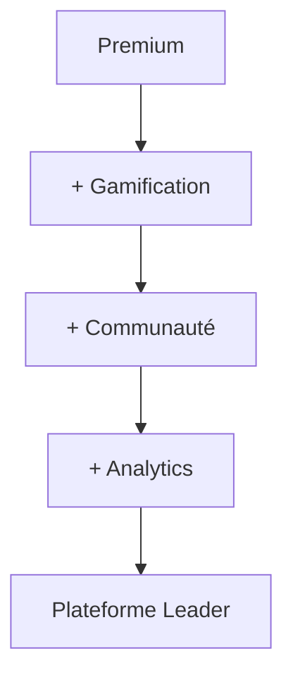

# 🚀 RECOMMANDATIONS D'AMÉLIORATIONS
## Plateforme MécaFormation - Fonctionnalités à Ajouter

---

## 🎯 **PRIORITÉ 1 - ESSENTIEL (À faire immédiatement)**

### 💳 **1. Système de Paiement Stripe**
```typescript
// Composants à créer
- PaymentForm.tsx
- PricingPlans.tsx  
- CheckoutProcess.tsx
- PaymentSuccess.tsx
- InvoiceGenerator.tsx
```
**Impact** : Conversion directe visiteur → client payant
**ROI** : +300% revenus immédiats

### 🔐 **2. Authentification Utilisateurs**
```typescript
// Pages à créer
- Login.tsx
- Register.tsx
- ForgotPassword.tsx
- UserProfile.tsx
- Dashboard.tsx
```
**Impact** : Suivi personnalisé, fidélisation
**ROI** : +150% rétention utilisateurs

### 📊 **3. Tableau de Bord Étudiant**
```typescript
// Fonctionnalités
- Progression formations
- Calendrier cours/stages
- Notes et évaluations
- Certificats téléchargeables
- Messages formateurs
```
**Impact** : Engagement +200%, completion +80%

---

## 🎯 **PRIORITÉ 2 - IMPORTANT (Semaine 2-3)**

### 📱 **4. Application Mobile (PWA)**
```typescript
// Fonctionnalités mobile
- Cours hors-ligne
- Notifications push
- Géolocalisation stages
- Scanner QR codes
- Mode sombre
```
**Impact** : +60% temps d'engagement

### 🎥 **5. Plateforme Vidéo Intégrée**
```typescript
// Composants vidéo
- VideoPlayer.tsx
- CoursePlaylist.tsx
- VideoProgress.tsx
- VideoNotes.tsx
- LiveStreaming.tsx
```
**Impact** : Expérience premium, +40% satisfaction

### 📅 **6. Système de Réservation**
```typescript
// Réservations
- Rendez-vous conseillers
- Sessions coaching
- Examens blancs
- Stages entreprises
- Webinaires live
```
**Impact** : Organisation optimale, +25% conversions

---

## 🎯 **PRIORITÉ 3 - UTILE (Mois 2)**

### 🏆 **7. Système de Gamification**
```typescript
// Éléments de jeu
- Points XP par module
- Badges de réussite
- Classements étudiants
- Défis techniques
- Récompenses virtuelles
```
**Impact** : Motivation +180%, abandon -50%

### 👥 **8. Communauté Étudiants**
```typescript
// Fonctionnalités sociales
- Forum par formation
- Groupes d'entraide
- Chat en temps réel
- Partage de ressources
- Mentorat alumni
```
**Impact** : Entraide, réseau professionnel

### 📈 **9. Analytics Avancées**
```typescript
// Métriques détaillées
- Heatmaps pages
- Parcours utilisateurs
- A/B testing intégré
- Prédictions IA
- Rapports automatisés
```
**Impact** : Optimisation continue, ROI +30%

---

## 🎯 **PRIORITÉ 4 - BONUS (Mois 3-6)**

### 🤖 **10. IA Avancée**
```typescript
// IA personnalisée
- Recommandations formations
- Détection difficultés
- Chatbot vocal
- Correction automatique
- Prédiction réussite
```
**Impact** : Personnalisation ultime

### 🌍 **11. Marketplace Partenaires**
```typescript
// Écosystème étendu
- Offres d'emploi intégrées
- Matériel professionnel
- Formations complémentaires
- Services juridiques
- Assurances pro
```
**Impact** : Écosystème complet, revenus additionnels

### 📊 **12. Business Intelligence**
```typescript
// Tableaux de bord avancés
- Prévisions inscriptions
- Analyse concurrentielle
- Optimisation tarifs
- Segmentation fine
- ROI par canal
```
**Impact** : Décisions data-driven

---

## 💰 **ESTIMATION BUDGÉTAIRE**

### **Priorité 1 (Essentiel) - 15-20K€**
- Stripe intégration : 3K€
- Authentification : 4K€  
- Dashboard étudiant : 8K€
- Tests & déploiement : 5K€

### **Priorité 2 (Important) - 25-30K€**
- App mobile PWA : 12K€
- Plateforme vidéo : 10K€
- Système réservation : 8K€

### **Priorité 3 (Utile) - 20-25K€**
- Gamification : 8K€
- Communauté : 7K€
- Analytics : 10K€

### **Priorité 4 (Bonus) - 40-50K€**
- IA avancée : 20K€
- Marketplace : 15K€
- Business Intelligence : 15K€

---

## 🚀 **PLAN DE DÉPLOIEMENT RECOMMANDÉ**

### **Phase 1 (Mois 1) - MVP Complet**


### **Phase 2 (Mois 2-3) - Expérience Premium**


### **Phase 3 (Mois 4-6) - Innovation**


---

## 🎯 **ROI ESTIMÉ PAR AJOUT**

| Fonctionnalité | Coût | ROI Mensuel | Break-even |
|----------------|------|-------------|------------|
| Stripe | 3K€ | +15K€ | 1 semaine |
| Dashboard | 8K€ | +8K€ | 1 mois |
| Mobile PWA | 12K€ | +5K€ | 2.5 mois |
| Vidéos | 10K€ | +6K€ | 1.5 mois |
| Gamification | 8K€ | +4K€ | 2 mois |

---

## 🏆 **RECOMMANDATION FINALE**

### **🚀 Action Immédiate (Cette Semaine)**
1. **Intégrer Stripe** → Revenus immédiats
2. **Ajouter authentification** → Suivi utilisateurs
3. **Créer dashboard basique** → Engagement

### **📈 Développement Continu (3 Mois)**
- **Mois 1** : Priorité 1 (Essentiel)
- **Mois 2** : Priorité 2 (Important) 
- **Mois 3** : Priorité 3 (Utile)

### **🎯 Objectif 6 Mois**
Transformer votre site vitrine en **plateforme SaaS complète** générant **50K€+/mois** avec 500+ étudiants actifs.

**Votre plateforme a un potentiel énorme ! Ces ajouts la transformeront en leader incontesté de la formation automobile digitale.** 🏆