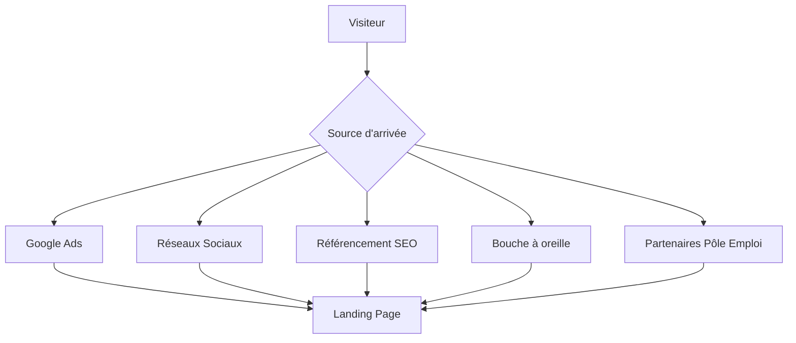
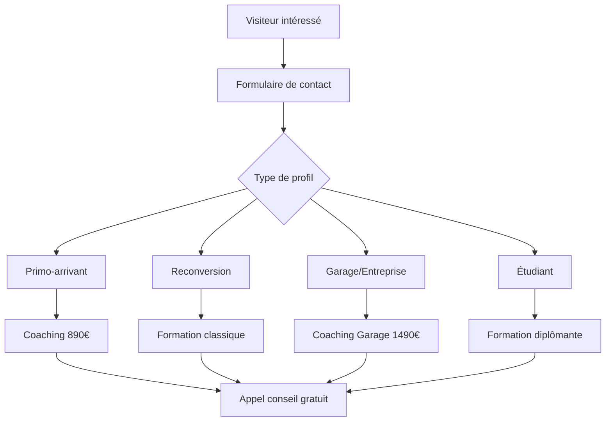
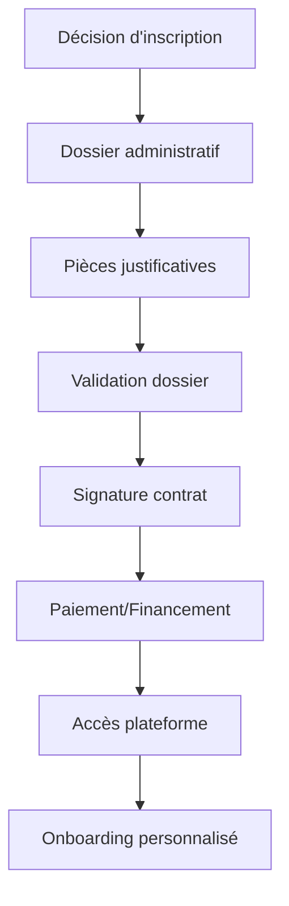
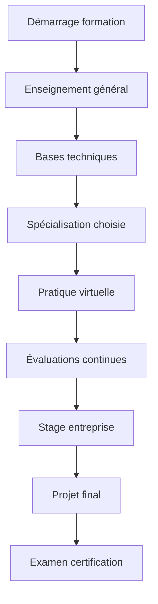
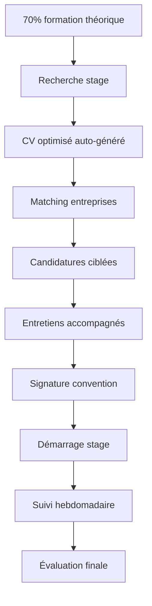
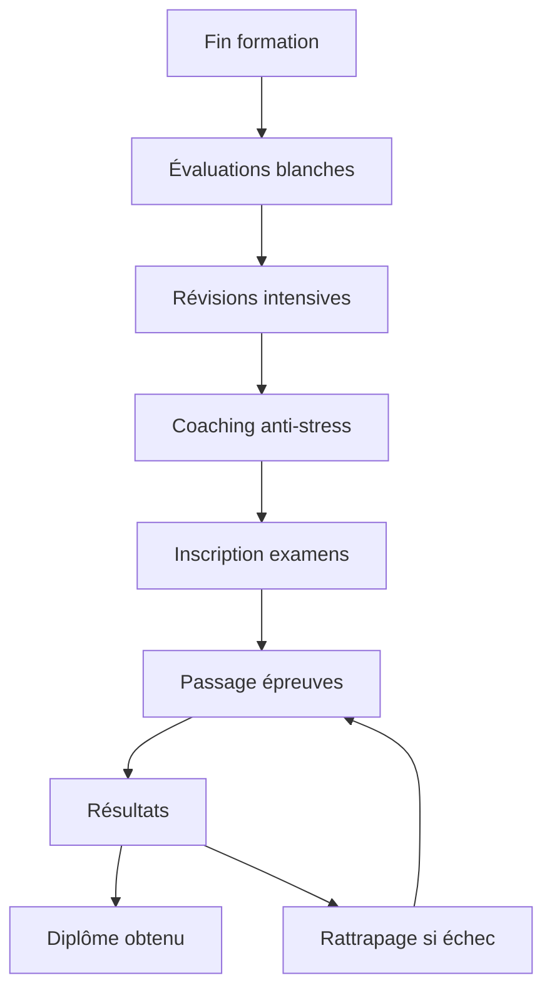
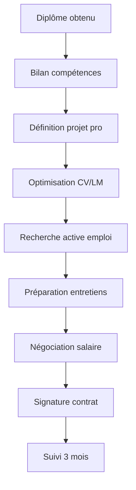
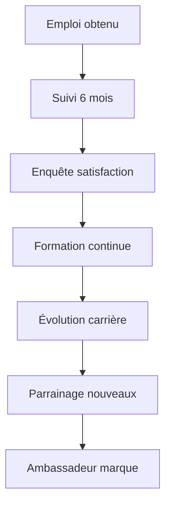

# 🔄 WORKFLOW COMPLET - PLATEFORME MÉCAFORMATION
## Processus de A à Z : Découverte → Formation → Insertion Professionnelle

---

## 🎯 **PHASE 1 : DÉCOUVERTE & ATTRACTION**

### **📱 Canaux d'Acquisition**

### **🎨 Première Impression (0-30 secondes)**
1. **Page d'accueil** avec avatar 3D captivant
2. **Message clair** : "Formation automobile 100% à distance"
3. **Tarifs attractifs** : 890€ primo-arrivants visible
4. **Preuves sociales** : 3000+ diplômés, 95% réussite
5. **CTA principal** : "Découvrir nos formations"

### **🤖 Engagement Immédiat**
- **ChatBot IA** se déclenche après 15 secondes
- **Avatar Alex** propose aide personnalisée
- **Questions qualifiantes** automatiques :
  - "Quel est votre profil ?"
  - "Quelle formation vous intéresse ?"
  - "Avez-vous des financements ?"

---

## 🎓 **PHASE 2 : QUALIFICATION & CONSEIL**

### **📋 Processus de Qualification**

### **☎️ Appel de Qualification (24h max)**
**Script type conseiller :**
1. **Accueil chaleureux** : "Bonjour, merci pour votre intérêt"
2. **Qualification besoins** :
   - Situation actuelle
   - Objectifs professionnels
   - Contraintes (temps, budget)
   - Niveau actuel
3. **Présentation solution** adaptée
4. **Réponse aux objections**
5. **Proposition rendez-vous** ou inscription

### **💰 Étude de Financement**
- **CPF** : Vérification droits acquis
- **Pôle Emploi** : AIF, POEI, POEC
- **OPCO** : Plan de développement compétences
- **Financement 0%** : Primo-arrivants
- **Facilités paiement** : 3x, 6x, 12x sans frais

---

## 📝 **PHASE 3 : INSCRIPTION & ONBOARDING**

### **✍️ Processus d'Inscription**

### **📄 Documents Requis**
- **Identité** : CNI, passeport
- **Diplômes** : Derniers obtenus
- **Situation** : Attestation Pôle Emploi, bulletins salaire
- **Financement** : Dossier CPF, accord OPCO
- **Motivation** : Lettre projet professionnel

### **🎯 Onboarding Personnalisé (Semaine 1)**
1. **Jour 1** : Accueil vidéo personnalisée du formateur
2. **Jour 2** : Test de positionnement complet
3. **Jour 3** : Parcours personnalisé généré
4. **Jour 4** : Premier cours interactif
5. **Jour 5** : Rendez-vous individuel formateur
6. **Weekend** : Accès libre plateforme e-learning

---

## 📚 **PHASE 4 : FORMATION ACTIVE**

### **🎓 Parcours Pédagogique Type**

### **📅 Planning Hebdomadaire Type**
**Lundi - Mercredi - Vendredi :**
- **9h-12h** : Cours théoriques en ligne
- **14h-17h** : Travaux pratiques virtuels
- **17h-18h** : Questions/réponses formateur

**Mardi - Jeudi :**
- **9h-11h** : Enseignement général
- **14h-16h** : Projets individuels
- **16h-17h** : Coaching personnalisé

**Weekend :**
- **Libre** : Révisions, rattrapages
- **Samedi 10h** : Webinaire groupe (optionnel)

### **🎯 Suivi Personnalisé**
- **Tableau de bord** progression temps réel
- **Alertes automatiques** : Retard, difficultés
- **Rendez-vous hebdo** : Formateur référent
- **Groupes d'entraide** : Discord/WhatsApp
- **Support technique** : 24h/7j

---

## 🏢 **PHASE 5 : STAGE EN ENTREPRISE**

### **🤝 Processus de Placement**

### **🎯 Réseau Partenaires (500+ entreprises)**
- **Garages indépendants** : Proximité, polyvalence
- **Concessions** : Spécialisation marque
- **Centres auto** : Volume, efficacité
- **Flottes entreprises** : Maintenance préventive
- **Stations hydrogène** : Technologies émergentes

### **📋 Suivi Stage**
- **Semaine 1** : Appel adaptation
- **Semaine 2** : Visite/visio formateur
- **Semaine 4** : Point mi-parcours
- **Semaine 6** : Évaluation compétences
- **Fin stage** : Bilan tripartite

---

## 🎓 **PHASE 6 : CERTIFICATION & DIPLOMATION**

### **📝 Préparation Examens**

### **🏆 Types de Certifications**
- **CAP MVA** : Diplôme d'État niveau 3
- **Bac Pro MVA** : Diplôme d'État niveau 4
- **Certificats spécialisés** : Électrique, Hydrogène, ADAS
- **Habilitations** : Électrique B0L, B1VL, B2VL
- **Certifications constructeurs** : Partenaires

---

## 💼 **PHASE 7 : INSERTION PROFESSIONNELLE**

### **🎯 Accompagnement Emploi (6 mois)**

### **📊 Outils d'Insertion**
- **Job board** dédié partenaires
- **Matching IA** : Profil ↔ Offres
- **Simulateur salaire** par région
- **Réseau alumni** : 3000+ diplômés
- **Événements networking** mensuels

### **💰 Objectifs Salariaux**
- **CAP débutant** : 1800-2200€/mois
- **CAP expérimenté** : 2200-2800€/mois
- **Bac Pro** : 2500-3200€/mois
- **Spécialiste électrique** : 2800-3800€/mois
- **Chef d'atelier** : 3200-4500€/mois

---

## 📈 **PHASE 8 : FIDÉLISATION & ÉVOLUTION**

### **🔄 Suivi Long Terme**

### **🎓 Formation Continue**
- **Veille technologique** : Newsletter mensuelle
- **Webinaires** : Nouvelles technologies
- **Formations courtes** : Spécialisations
- **Certifications** : Mise à jour compétences
- **Évolution** : Management, expertise

---

## 🤖 **AUTOMATISATION & OUTILS**

### **💻 Stack Technologique**
- **CRM** : Suivi prospects/étudiants
- **LMS** : Plateforme e-learning
- **IA ChatBot** : Support 24/7
- **Visioconférence** : Cours/coaching
- **Mobile App** : Formation nomade

### **📊 KPIs de Suivi**
- **Acquisition** : Coût/lead, conversion
- **Formation** : Assiduité, progression
- **Insertion** : Taux placement, salaires
- **Satisfaction** : NPS, avis Google
- **Fidélisation** : Recommandations, alumni

---

## 🎯 **WORKFLOW SPÉCIALISÉS**

### **👶 Primo-Arrivants (890€)**
1. **Accueil renforcé** : Accompagnement 24/7
2. **Enseignement général** : Maths, français, anglais
3. **Coaching motivation** : Confiance en soi
4. **Financement 0%** : 12 mois sans frais
5. **Insertion garantie** : Suivi 12 mois

### **🏢 Garages Pro (1490€/équipe)**
1. **Audit atelier** : Diagnostic organisation
2. **Formation équipe** : Jusqu'à 8 personnes
3. **Plateforme dédiée** : Contenus sur-mesure
4. **ROI calculé** : Productivité, qualité
5. **Support permanent** : Hotline technique

---

## 📞 **POINTS DE CONTACT**

### **🔥 Support Multi-Canal**
- **WhatsApp** : +33 6 89 45 72 31 (24/7)
- **Email** : contact@mecaformation.fr (2h)
- **ChatBot IA** : Site web (instantané)
- **Téléphone** : Rendez-vous planifiés
- **Visio** : Coaching personnalisé

### **⏰ Disponibilités**
- **WhatsApp** : 24h/7j (réponse garantie)
- **Email** : Lun-Ven 8h-18h (2h max)
- **Téléphone** : Lun-Ven 9h-17h
- **Urgences** : WhatsApp prioritaire

---

## 🏆 **GARANTIES & ENGAGEMENTS**

### **✅ Nos Promesses**
- **95% réussite** aux examens
- **87% insertion** dans les 6 mois
- **Support 24/7** via WhatsApp
- **Stage garanti** dans notre réseau
- **Remboursement** si non satisfait (30j)

### **🎯 Indicateurs de Réussite**
- **Satisfaction** : >4.8/5 (Google Reviews)
- **Recommandation** : >90% (NPS)
- **Évolution salaire** : +40% post-formation
- **Fidélisation** : 85% formation continue
- **Ambassadeurs** : 60% parrainent

---

**🚀 Ce workflow garantit une expérience exceptionnelle de bout en bout, de la découverte à l'insertion professionnelle réussie !**