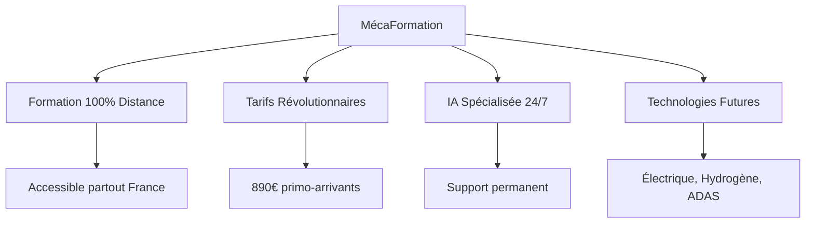
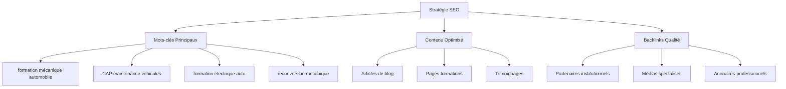
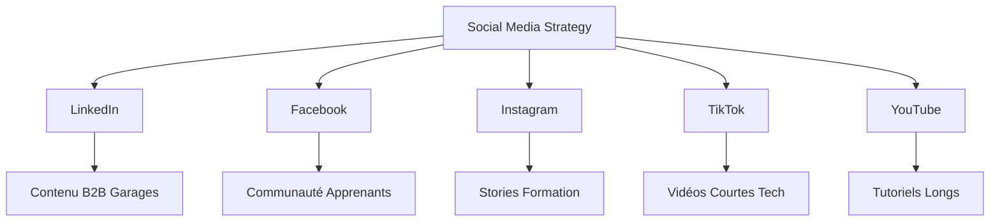
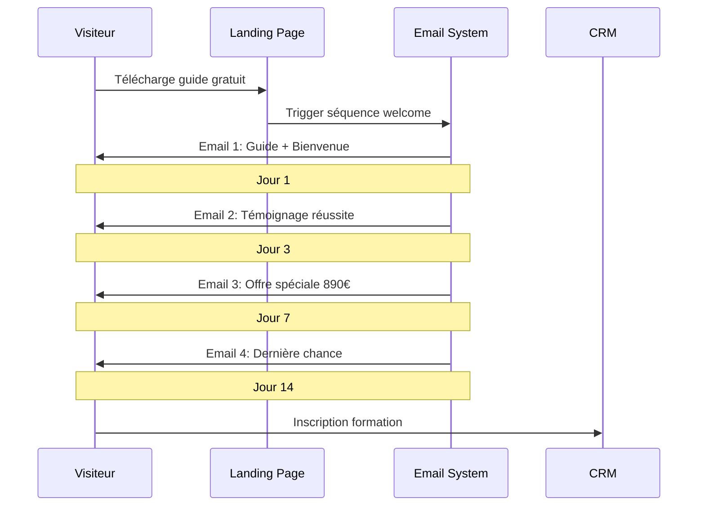
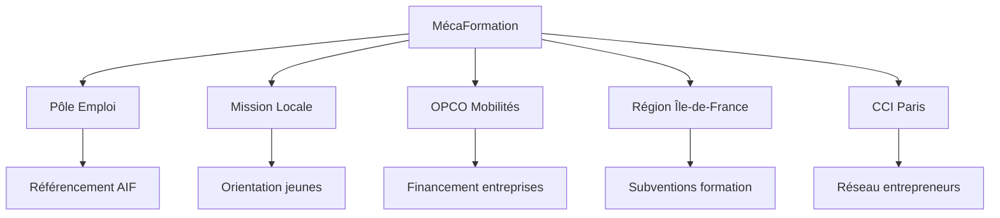
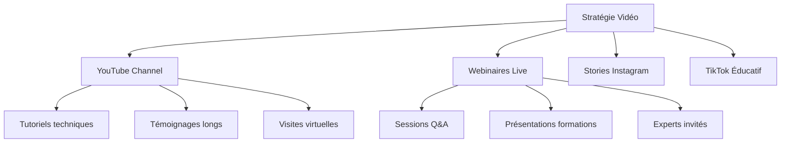
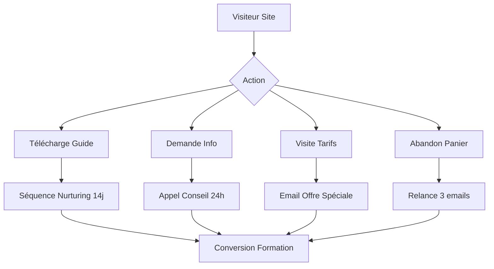

# 📢 WORKFLOW MARKETING - PLATEFORME MÉCAFORMATION
## Stratégie Marketing Digitale Complète

---

## 🎯 **STRATÉGIE GLOBALE**

### **🎨 Positionnement Unique**


### **🎯 Cibles Prioritaires**
1. **Primo-arrivants** (18-25 ans) - 40% du marché
2. **Reconversion professionnelle** (30-45 ans) - 35%
3. **Garages/Entreprises** (formation équipe) - 15%
4. **Demandeurs d'emploi** (tous âges) - 10%

---

## 📱 **MARKETING DIGITAL**

### **🔍 SEO - Référencement Naturel**


**Mots-clés Stratégiques :**
- **Volume élevé** : "formation mécanique" (8900/mois)
- **Longue traîne** : "formation véhicule électrique à distance" (320/mois)
- **Local** : "formation mécanique Paris" (1200/mois)
- **Spécialisé** : "CAP maintenance véhicules primo-arrivant" (150/mois)

### **💰 SEA - Google Ads**
```yaml
Campagnes Google Ads:
  Formation_Generale:
    budget: 2000€/mois
    mots_cles: ["formation mécanique", "CAP automobile"]
    cpc_moyen: 1.50€
    taux_conversion: 8%
    
  Primo_Arrivants:
    budget: 1500€/mois
    mots_cles: ["primo arrivant formation", "890 euros formation"]
    cpc_moyen: 1.20€
    taux_conversion: 12%
    
  Reconversion:
    budget: 1800€/mois
    mots_cles: ["reconversion mécanique", "changer métier automobile"]
    cpc_moyen: 1.80€
    taux_conversion: 10%
    
  Garages:
    budget: 1000€/mois
    mots_cles: ["formation équipe garage", "1490 euros formation"]
    cpc_moyen: 2.50€
    taux_conversion: 15%
```

### **📱 Réseaux Sociaux**


**Planning Contenu Hebdomadaire :**
- **Lundi** : Conseil technique (LinkedIn)
- **Mardi** : Témoignage étudiant (Facebook)
- **Mercredi** : Behind the scenes (Instagram)
- **Jeudi** : Actualité automobile (LinkedIn)
- **Vendredi** : Quiz technique (TikTok)
- **Weekend** : Tutoriel long (YouTube)

---

## 📧 **EMAIL MARKETING**

### **📬 Séquences Automatisées**


### **🎯 Segmentation Avancée**
```yaml
Segments_Email:
  Primo_Arrivants:
    criteres: [age < 26, premier_emploi = true]
    contenu: "Tarif 890€, financement 0%"
    frequence: "2 emails/semaine"
    
  Reconversion:
    criteres: [age > 30, emploi_actuel != automobile]
    contenu: "Success stories, CPF, OPCO"
    frequence: "1 email/semaine"
    
  Garages:
    criteres: [type = entreprise, employees > 3]
    contenu: "ROI, productivité, 1490€/équipe"
    frequence: "1 email/2 semaines"
    
  Inactifs:
    criteres: [derniere_ouverture > 30_jours]
    contenu: "Réactivation, offre spéciale"
    frequence: "1 email/mois"
```

---

## 🤝 **PARTENARIATS STRATÉGIQUES**

### **🏢 Partenaires Institutionnels**


### **🔧 Partenaires Techniques**
- **Constructeurs** : Formations certifiantes
- **Équipementiers** : Bosch, Valeo, Continental
- **Distributeurs** : GSF, Autodistribution
- **Médias** : L'Argus, Auto Infos, Décision Atelier

### **💼 Programme d'Affiliation**
```yaml
Programme_Affiliation:
  Ambassadeurs_Alumni:
    commission: 100€ par inscription
    bonus: 500€ si 10 parrainages/an
    
  Partenaires_Garages:
    commission: 200€ par inscription
    formation_gratuite: 1 place offerte/5 inscriptions
    
  Influenceurs_Auto:
    commission: 5% du CA généré
    contenu_exclusif: Accès plateforme premium
```

---

## 📊 **CONTENT MARKETING**

### **📝 Blog Stratégique**
```yaml
Planning_Editorial:
  Semaine_1:
    lundi: "Guide complet CAP MVA 2024"
    mercredi: "Véhicules électriques : 10 points clés"
    vendredi: "Témoignage : De chômeur à chef d'atelier"
    
  Semaine_2:
    lundi: "Financement formation : CPF vs OPCO"
    mercredi: "Diagnostic hydrogène : l'avenir"
    vendredi: "Salaires mécanique 2024 par région"
    
  Semaine_3:
    lundi: "Formation à distance : 5 avantages"
    mercredi: "ADAS : révolution technologique"
    vendredi: "Success story garage : +40% CA"
    
  Semaine_4:
    lundi: "Reconversion à 40 ans : témoignage"
    mercredi: "Maintenance préventive électrique"
    vendredi: "Primo-arrivant : mode d'emploi"
```

### **🎥 Contenu Vidéo**


**Objectifs Vidéo 2024 :**
- **YouTube** : 10K abonnés, 500K vues
- **Webinaires** : 24 sessions, 50 participants/session
- **TikTok** : 50K followers, 2M vues
- **Instagram** : 25K followers, 1M impressions

---

## 📱 **MARKETING AUTOMATION**

### **🤖 Workflows Automatisés**


### **🎯 Lead Scoring**
```yaml
Lead_Scoring:
  Actions_Site:
    visite_page_tarifs: +15 points
    telechargement_guide: +10 points
    temps_site_5min: +8 points
    visite_temoignages: +5 points
    
  Engagement_Email:
    ouverture_email: +2 points
    clic_email: +5 points
    reponse_email: +10 points
    
  Profil_Demographique:
    age_18_30: +10 points
    demandeur_emploi: +15 points
    region_idf: +5 points
    
  Seuils_Qualification:
    cold_lead: 0-20 points
    warm_lead: 21-40 points
    hot_lead: 41+ points
```

---

## 📞 **MARKETING CONVERSATIONNEL**

### **💬 WhatsApp Business**
```yaml
WhatsApp_Strategy:
  Numero: "+33 6 89 45 72 31"
  Disponibilite: "24h/7j"
  
  Messages_Automatiques:
    bienvenue: "Bonjour ! 👋 Merci de nous contacter. Comment puis-je vous aider avec nos formations automobile ?"
    absence: "Merci pour votre message. Nous vous répondons dans les 15 minutes !"
    
  Quick_Replies:
    - "📚 Voir nos formations"
    - "💰 Tarifs et financement"  
    - "📞 Demander un rappel"
    - "🎓 Témoignages étudiants"
    
  Workflows:
    demande_info:
      - Qualification profil
      - Envoi brochure PDF
      - Proposition rendez-vous
      
    tarifs:
      - Questions financement
      - Calcul personnalisé
      - Offre sur-mesure
```

### **🤖 ChatBot IA Avancé**
```typescript
// Scénarios ChatBot
const chatbotScenarios = {
  formation_inquiry: {
    trigger: ["formation", "cours", "apprendre"],
    response: "Nous proposons 13 formations différentes. Quel est votre profil ?",
    followUp: ["primo-arrivant", "reconversion", "garage"]
  },
  
  pricing_question: {
    trigger: ["prix", "coût", "tarif", "890", "1490"],
    response: "Nos tarifs sont révolutionnaires ! 890€ pour primo-arrivants, 1490€ pour équipes garage.",
    followUp: ["financement", "détails", "inscription"]
  },
  
  technology_question: {
    trigger: ["électrique", "hybride", "hydrogène"],
    response: "Nous sommes spécialisés dans les nouvelles technologies ! Quelle technologie vous intéresse ?",
    followUp: ["diagnostic", "formation", "débouchés"]
  }
};
```

---

## 📈 **ANALYTICS & OPTIMISATION**

### **📊 KPIs Marketing**
```yaml
KPIs_Acquisition:
  Trafic:
    visiteurs_uniques: 5000/mois
    pages_vues: 25000/mois
    taux_rebond: <45%
    temps_session: >3min
    
  Conversion:
    leads_qualifies: 400/mois
    taux_conversion_lead: 8%
    inscriptions: 32/mois
    taux_conversion_inscription: 8%
    
  ROI:
    cout_acquisition_lead: 15€
    cout_acquisition_client: 187€
    ltv_client: 2500€
    roi_marketing: 13:1
```

### **🔍 A/B Testing**
```yaml
Tests_En_Cours:
  Landing_Page_Hero:
    version_a: "Devenez Expert en Mécanique"
    version_b: "Formation Automobile 890€"
    metrique: taux_conversion_formulaire
    
  Email_Subject:
    version_a: "Votre formation automobile vous attend"
    version_b: "890€ seulement : Formation mécanique"
    metrique: taux_ouverture
    
  CTA_Button:
    version_a: "Découvrir nos formations"
    version_b: "Commencer maintenant"
    metrique: taux_clic
```

---

## 🎯 **CAMPAGNES SPÉCIALES**

### **🚀 Lancement Primo-Arrivants**
```yaml
Campagne_890_Euros:
  duree: "3 mois"
  budget: "15000€"
  
  Canaux:
    google_ads: 8000€
    facebook_ads: 4000€
    influenceurs: 2000€
    email_marketing: 1000€
    
  Objectifs:
    leads: 800
    inscriptions: 80
    roi: 10:1
    
  Creatives:
    - "890€ : Prix révolutionnaire formation auto"
    - "Primo-arrivant ? Votre avenir commence ici"
    - "Financement 0% : Devenez mécanicien"
```

### **🏢 Campagne Garages B2B**
```yaml
Campagne_1490_Garages:
  duree: "6 mois"
  budget: "12000€"
  
  Canaux:
    linkedin_ads: 6000€
    google_ads_b2b: 4000€
    salons_professionnels: 2000€
    
  Objectifs:
    leads_qualifies: 120
    demos: 60
    inscriptions: 18
    
  Messages:
    - "1490€ : Formez toute votre équipe"
    - "ROI garanti : +40% productivité"
    - "8 personnes formées, 1 seul prix"
```

---

## 📅 **PLANNING MARKETING 2024**

### **🗓️ Roadmap Annuelle**
```yaml
Q1_2024:
  janvier:
    - Lancement campagne primo-arrivants
    - Optimisation SEO pages formations
    - Création contenu blog (12 articles)
    
  fevrier:
    - Campagne Saint-Valentin "Aimez votre métier"
    - Webinaire "Véhicules électriques 2024"
    - Partenariat Mission Locale
    
  mars:
    - Salon de l'automobile Paris
    - Campagne reconversion "Nouveau départ"
    - Lancement programme affiliation

Q2_2024:
  avril:
    - Campagne garages "Printemps formation"
    - Création chaîne YouTube
    - Tests A/B landing pages
    
  mai:
    - Webinaire "Hydrogène : l'avenir"
    - Campagne financement CPF
    - Partenariat OPCO Mobilités
    
  juin:
    - Bilan mi-année
    - Optimisation campagnes
    - Préparation rentrée septembre

Q3_2024:
  juillet:
    - Campagne été "Formation vacances"
    - Création contenu TikTok
    - Développement influenceurs
    
  aout:
    - Préparation rentrée
    - Campagne "Nouvelle vie"
    - Optimisation mobile
    
  septembre:
    - Grande campagne rentrée
    - Webinaire "Technologies 2025"
    - Lancement newsletter

Q4_2024:
  octobre:
    - Campagne Halloween "Réveillez le mécanicien en vous"
    - Salon Équip Auto
    - Bilan formations
    
  novembre:
    - Black Friday formation
    - Campagne fin d'année CPF
    - Préparation 2025
    
  decembre:
    - Bilan annuel
    - Planification 2025
    - Campagne "Résolutions 2025"
```

---

## 🏆 **OBJECTIFS 2024**

### **🎯 Objectifs Quantitatifs**
- **Trafic** : 60K visiteurs uniques/an
- **Leads** : 4800 leads qualifiés/an
- **Inscriptions** : 384 nouvelles inscriptions/an
- **CA Marketing** : 960K€ généré
- **ROI** : 12:1 retour sur investissement

### **🌟 Objectifs Qualitatifs**
- **Notoriété** : Top 3 formations auto distance
- **Réputation** : 4.8/5 avis Google
- **Communauté** : 50K followers réseaux sociaux
- **Expertise** : Référence technologies futures

---

**🚀 Cette stratégie marketing révolutionnaire va propulser MécaFormation au sommet de la formation automobile en France !**