# ⚙️ WORKFLOW TECHNIQUE - PLATEFORME MÉCAFORMATION
## Architecture & Processus Techniques Détaillés

---

## 🏗️ **ARCHITECTURE SYSTÈME**

### **📱 Frontend (React + TypeScript)**


### **🗄️ Backend (Supabase)**


---

## 🔐 **GESTION UTILISATEURS**

### **👤 Authentification Flow**

```mermaid
sequenceDiagram
    participant U as Utilisateur
    participant F as Frontend
    participant S as Supabase
    participant E as Email Service
    
    U->>F: Inscription/Connexion
    F->>S: Auth Request
    S->>E: Send Verification Email
    E->>U: Email de confirmation
    U->>S: Confirm Email
    S->>F: Auth Token
    F->>U: Accès plateforme
```


### **📊 Profils Utilisateurs**
```sql
-- Table users (extends Supabase auth.users)
CREATE TABLE profiles (
  id UUID REFERENCES auth.users PRIMARY KEY,
  email TEXT UNIQUE NOT NULL,
  first_name TEXT,
  last_name TEXT,
  phone TEXT,
  profile_type TEXT CHECK (profile_type IN ('student', 'garage', 'admin')),
  created_at TIMESTAMP DEFAULT NOW(),
  updated_at TIMESTAMP DEFAULT NOW()
);

-- Table student_profiles
CREATE TABLE student_profiles (
  id UUID REFERENCES profiles PRIMARY KEY,
  birth_date DATE,
  address TEXT,
  city TEXT,
  postal_code TEXT,
  education_level TEXT,
  employment_status TEXT,
  motivation_letter TEXT,
  financing_type TEXT,
  created_at TIMESTAMP DEFAULT NOW()
);

-- Table garage_profiles  
CREATE TABLE garage_profiles (
  id UUID REFERENCES profiles PRIMARY KEY,
  company_name TEXT NOT NULL,
  siret TEXT,
  address TEXT,
  city TEXT,
  postal_code TEXT,
  team_size INTEGER,
  specializations TEXT[],
  created_at TIMESTAMP DEFAULT NOW()
);
```

---

## 🎓 **SYSTÈME DE FORMATIONS**

### **📚 Structure des Formations**
```sql
-- Table formations
CREATE TABLE formations (
  id UUID PRIMARY KEY DEFAULT gen_random_uuid(),
  title TEXT NOT NULL,
  subtitle TEXT,
  description TEXT,
  level TEXT CHECK (level IN ('CAP', 'BAC_PRO', 'BTS', 'SPECIALIZATION')),
  duration_months INTEGER,
  price_euros INTEGER,
  max_students INTEGER,
  is_active BOOLEAN DEFAULT true,
  features TEXT[],
  prerequisites TEXT[],
  created_at TIMESTAMP DEFAULT NOW()
);

-- Table modules
CREATE TABLE modules (
  id UUID PRIMARY KEY DEFAULT gen_random_uuid(),
  formation_id UUID REFERENCES formations,
  title TEXT NOT NULL,
  description TEXT,
  order_index INTEGER,
  duration_hours INTEGER,
  content_type TEXT CHECK (content_type IN ('video', 'document', 'quiz', 'practical')),
  content_url TEXT,
  is_mandatory BOOLEAN DEFAULT true
);

-- Table enrollments
CREATE TABLE enrollments (
  id UUID PRIMARY KEY DEFAULT gen_random_uuid(),
  student_id UUID REFERENCES profiles,
  formation_id UUID REFERENCES formations,
  status TEXT CHECK (status IN ('pending', 'active', 'completed', 'cancelled')),
  start_date DATE,
  end_date DATE,
  progress_percentage INTEGER DEFAULT 0,
  payment_status TEXT CHECK (payment_status IN ('pending', 'paid', 'refunded')),
  created_at TIMESTAMP DEFAULT NOW()
);
```

### **📈 Suivi de Progression**
```sql
-- Table progress
CREATE TABLE progress (
  id UUID PRIMARY KEY DEFAULT gen_random_uuid(),
  enrollment_id UUID REFERENCES enrollments,
  module_id UUID REFERENCES modules,
  status TEXT CHECK (status IN ('not_started', 'in_progress', 'completed')),
  completion_date TIMESTAMP,
  score INTEGER,
  time_spent_minutes INTEGER,
  created_at TIMESTAMP DEFAULT NOW()
);

-- Table assessments
CREATE TABLE assessments (
  id UUID PRIMARY KEY DEFAULT gen_random_uuid(),
  enrollment_id UUID REFERENCES enrollments,
  module_id UUID REFERENCES modules,
  questions JSONB,
  answers JSONB,
  score INTEGER,
  max_score INTEGER,
  passed BOOLEAN,
  completed_at TIMESTAMP DEFAULT NOW()
);
```

---

## 💳 **SYSTÈME DE PAIEMENT**

### **🔄 Workflow Stripe**


### **💰 Gestion des Paiements**
```sql
-- Table payments
CREATE TABLE payments (
  id UUID PRIMARY KEY DEFAULT gen_random_uuid(),
  enrollment_id UUID REFERENCES enrollments,
  stripe_payment_intent_id TEXT UNIQUE,
  amount_euros INTEGER NOT NULL,
  currency TEXT DEFAULT 'EUR',
  status TEXT CHECK (status IN ('pending', 'succeeded', 'failed', 'cancelled')),
  payment_method TEXT,
  installments INTEGER DEFAULT 1,
  installment_number INTEGER DEFAULT 1,
  due_date DATE,
  paid_at TIMESTAMP,
  created_at TIMESTAMP DEFAULT NOW()
);

-- Table financing
CREATE TABLE financing (
  id UUID PRIMARY KEY DEFAULT gen_random_uuid(),
  enrollment_id UUID REFERENCES enrollments,
  type TEXT CHECK (type IN ('cpf', 'pole_emploi', 'opco', 'self', 'installments')),
  amount_covered_euros INTEGER,
  approval_status TEXT CHECK (approval_status IN ('pending', 'approved', 'rejected')),
  documents JSONB,
  notes TEXT,
  created_at TIMESTAMP DEFAULT NOW()
);
```

---

## 🤖 **INTELLIGENCE ARTIFICIELLE**

### **💬 ChatBot & IA**
```typescript
// AI Knowledge Base Structure
interface KnowledgeBase {
  [category: string]: {
    keywords: string[];
    responses: string[];
    context: string;
    confidence: number;
  };
}

// AI Response Generation
class AIAssistant {
  private knowledgeBase: KnowledgeBase;
  
  async generateResponse(userMessage: string): Promise<AIResponse> {
    const analysis = await this.analyzeMessage(userMessage);
    const context = await this.getContext(analysis);
    const response = await this.generateContextualResponse(context);
    
    return {
      text: response.text,
      confidence: response.confidence,
      suggestedActions: response.actions,
      category: analysis.category
    };
  }
  
  private async analyzeMessage(message: string): Promise<MessageAnalysis> {
    // NLP processing, intent detection
    return {
      intent: 'formation_inquiry',
      entities: ['CAP', 'véhicule électrique'],
      sentiment: 'positive',
      category: 'formation'
    };
  }
}
```

### **🎯 Personnalisation IA**
```sql
-- Table ai_conversations
CREATE TABLE ai_conversations (
  id UUID PRIMARY KEY DEFAULT gen_random_uuid(),
  user_id UUID REFERENCES profiles,
  session_id TEXT,
  messages JSONB,
  context JSONB,
  satisfaction_score INTEGER,
  created_at TIMESTAMP DEFAULT NOW()
);

-- Table ai_learning
CREATE TABLE ai_learning (
  id UUID PRIMARY KEY DEFAULT gen_random_uuid(),
  question TEXT NOT NULL,
  response TEXT NOT NULL,
  feedback_score INTEGER,
  category TEXT,
  improved_response TEXT,
  created_at TIMESTAMP DEFAULT NOW()
);
```

---

## 📊 **ANALYTICS & TRACKING**

### **📈 Métriques Business**
```sql
-- Table analytics_events
CREATE TABLE analytics_events (
  id UUID PRIMARY KEY DEFAULT gen_random_uuid(),
  user_id UUID REFERENCES profiles,
  event_type TEXT NOT NULL,
  event_data JSONB,
  page_url TEXT,
  user_agent TEXT,
  ip_address INET,
  created_at TIMESTAMP DEFAULT NOW()
);

-- Vue métriques clés
CREATE VIEW key_metrics AS
SELECT 
  DATE_TRUNC('day', created_at) as date,
  COUNT(*) FILTER (WHERE event_type = 'page_view') as page_views,
  COUNT(DISTINCT user_id) FILTER (WHERE event_type = 'page_view') as unique_visitors,
  COUNT(*) FILTER (WHERE event_type = 'form_submit') as form_submissions,
  COUNT(*) FILTER (WHERE event_type = 'enrollment_completed') as enrollments
FROM analytics_events
GROUP BY DATE_TRUNC('day', created_at);
```

### **🎯 Funnel de Conversion**

```mermaid
graph TD
    A[Visiteur] --> B[Page vue]
    B --> C[Formulaire contact]
    C --> D[Appel conseil]
    D --> E[Inscription]
    E --> F[Paiement]
    F --> G[Formation active]
    G --> H[Diplôme obtenu]
    H --> I[Emploi trouvé]
    
    B --> J[Taux rebond: 45%]
    C --> K[Conversion: 12%]
    D --> L[Qualification: 78%]
    E --> M[Closing: 65%]
    F --> N[Paiement: 95%]
    G --> O[Completion: 87%]
    H --> P[Réussite: 95%]
    I --> Q[Insertion: 87%]
```


---

## 🔄 **AUTOMATISATIONS**

### **📧 Email Marketing**
```typescript
// Email Automation Workflows
interface EmailWorkflow {
  trigger: 'signup' | 'enrollment' | 'completion' | 'inactivity';
  delay: number; // minutes
  conditions: EmailCondition[];
  template: string;
  personalization: PersonalizationData;
}

const emailWorkflows: EmailWorkflow[] = [
  {
    trigger: 'signup',
    delay: 0,
    conditions: [],
    template: 'welcome_email',
    personalization: { firstName: true, formationInterest: true }
  },
  {
    trigger: 'enrollment',
    delay: 1440, // 24h
    conditions: [{ field: 'progress', operator: '<', value: 10 }],
    template: 'getting_started_reminder',
    personalization: { firstName: true, nextModule: true }
  }
];
```

### **🤖 Tâches Automatisées**
```sql
-- Table automated_tasks
CREATE TABLE automated_tasks (
  id UUID PRIMARY KEY DEFAULT gen_random_uuid(),
  task_type TEXT NOT NULL,
  target_id UUID,
  scheduled_for TIMESTAMP,
  status TEXT CHECK (status IN ('pending', 'running', 'completed', 'failed')),
  parameters JSONB,
  result JSONB,
  created_at TIMESTAMP DEFAULT NOW()
);

-- Exemples de tâches automatisées
INSERT INTO automated_tasks (task_type, target_id, scheduled_for, parameters) VALUES
('send_reminder_email', 'user_uuid', NOW() + INTERVAL '1 day', '{"template": "course_reminder"}'),
('generate_certificate', 'enrollment_uuid', NOW(), '{"format": "pdf"}'),
('update_progress', 'enrollment_uuid', NOW(), '{"module_id": "module_uuid"}');
```

---

## 🔒 **SÉCURITÉ & CONFORMITÉ**

### **🛡️ Sécurité des Données**
```typescript
// Row Level Security (RLS) Policies
const securityPolicies = {
  profiles: {
    select: 'auth.uid() = id OR auth.role() = "admin"',
    insert: 'auth.uid() = id',
    update: 'auth.uid() = id OR auth.role() = "admin"',
    delete: 'auth.role() = "admin"'
  },
  enrollments: {
    select: 'auth.uid() = student_id OR auth.role() = "admin"',
    insert: 'auth.uid() = student_id',
    update: 'auth.role() = "admin"'
  }
};
```

### **📋 RGPD Compliance**
```sql
-- Table consent_tracking
CREATE TABLE consent_tracking (
  id UUID PRIMARY KEY DEFAULT gen_random_uuid(),
  user_id UUID REFERENCES profiles,
  consent_type TEXT NOT NULL,
  granted BOOLEAN NOT NULL,
  ip_address INET,
  user_agent TEXT,
  granted_at TIMESTAMP DEFAULT NOW()
);

-- Table data_deletion_requests
CREATE TABLE data_deletion_requests (
  id UUID PRIMARY KEY DEFAULT gen_random_uuid(),
  user_id UUID REFERENCES profiles,
  request_date TIMESTAMP DEFAULT NOW(),
  processed_date TIMESTAMP,
  status TEXT CHECK (status IN ('pending', 'processed', 'rejected')),
  reason TEXT
);
```

---

## 📱 **API & INTÉGRATIONS**

### **🔌 API Endpoints**
```typescript
// REST API Structure
const apiEndpoints = {
  // Authentication
  'POST /auth/signup': 'User registration',
  'POST /auth/login': 'User login',
  'POST /auth/logout': 'User logout',
  
  // Formations
  'GET /formations': 'List all formations',
  'GET /formations/:id': 'Get formation details',
  'POST /enrollments': 'Enroll in formation',
  
  // Progress
  'GET /progress/:enrollmentId': 'Get user progress',
  'PUT /progress/:enrollmentId/:moduleId': 'Update module progress',
  
  // Payments
  'POST /payments/create-intent': 'Create Stripe payment intent',
  'POST /payments/webhook': 'Handle Stripe webhooks',
  
  // AI Assistant
  'POST /ai/chat': 'Send message to AI assistant',
  'GET /ai/suggestions': 'Get AI suggestions'
};
```

### **🔗 Intégrations Externes**

```mermaid
graph TD
    A[MécaFormation Platform] --> B[Stripe Payment]
    A --> C[SendGrid Email]
    A --> D[Twilio SMS]
    A --> E[Google Analytics]
    A --> F[Facebook Pixel]
    A --> G[Pôle Emploi API]
    A --> H[CPF API]
    A --> I[Zoom Video]
    A --> J[Discord Community]
```


---

## 🚀 **DÉPLOIEMENT & MONITORING**

### **📦 CI/CD Pipeline**
```yaml
# .github/workflows/deploy.yml
name: Deploy to Production
on:
  push:
    branches: [main]

jobs:
  deploy:
    runs-on: ubuntu-latest
    steps:
      - uses: actions/checkout@v2
      - name: Setup Node.js
        uses: actions/setup-node@v2
        with:
          node-version: '18'
      - name: Install dependencies
        run: npm ci
      - name: Run tests
        run: npm test
      - name: Build application
        run: npm run build
      - name: Deploy to Bolt Hosting
        run: npm run deploy
```

### **📊 Monitoring & Alertes**
```typescript
// Health Check Endpoints
const healthChecks = {
  '/health': {
    database: 'SELECT 1',
    redis: 'PING',
    stripe: 'GET /v1/account',
    email: 'Send test email'
  },
  
  '/metrics': {
    activeUsers: 'COUNT active sessions',
    responseTime: 'Average API response time',
    errorRate: 'Error rate last 24h',
    conversionRate: 'Signup to enrollment rate'
  }
};

// Alerting Rules
const alerts = [
  {
    condition: 'error_rate > 5%',
    action: 'Send email to dev team',
    severity: 'high'
  },
  {
    condition: 'response_time > 2s',
    action: 'Scale up servers',
    severity: 'medium'
  }
];
```

---

## 🎯 **PERFORMANCE & OPTIMISATION**

### **⚡ Optimisations Frontend**
```typescript
// Code Splitting
const LazyFormations = lazy(() => import('./components/FormationsSection'));
const LazyResources = lazy(() => import('./components/ResourcesPlatform'));

// Memoization
const MemoizedFormationCard = memo(FormationCard);

// Virtual Scrolling for large lists
const VirtualizedFormationList = ({ formations }) => (
  <FixedSizeList
    height={600}
    itemCount={formations.length}
    itemSize={200}
  >
    {({ index, style }) => (
      <div style={style}>
        <FormationCard formation={formations[index]} />
      </div>
    )}
  </FixedSizeList>
);
```

### **🗄️ Optimisations Base de Données**
```sql
-- Index pour performances
CREATE INDEX idx_enrollments_student_status ON enrollments(student_id, status);
CREATE INDEX idx_progress_enrollment_module ON progress(enrollment_id, module_id);
CREATE INDEX idx_analytics_events_type_date ON analytics_events(event_type, created_at);

-- Vues matérialisées pour rapports
CREATE MATERIALIZED VIEW enrollment_stats AS
SELECT 
  formation_id,
  COUNT(*) as total_enrollments,
  COUNT(*) FILTER (WHERE status = 'completed') as completed,
  AVG(progress_percentage) as avg_progress
FROM enrollments
GROUP BY formation_id;

-- Refresh automatique
CREATE OR REPLACE FUNCTION refresh_enrollment_stats()
RETURNS void AS $$
BEGIN
  REFRESH MATERIALIZED VIEW enrollment_stats;
END;
$$ LANGUAGE plpgsql;
```

---

**🏆 Cette architecture technique garantit une plateforme robuste, scalable et performante pour révolutionner la formation automobile !**