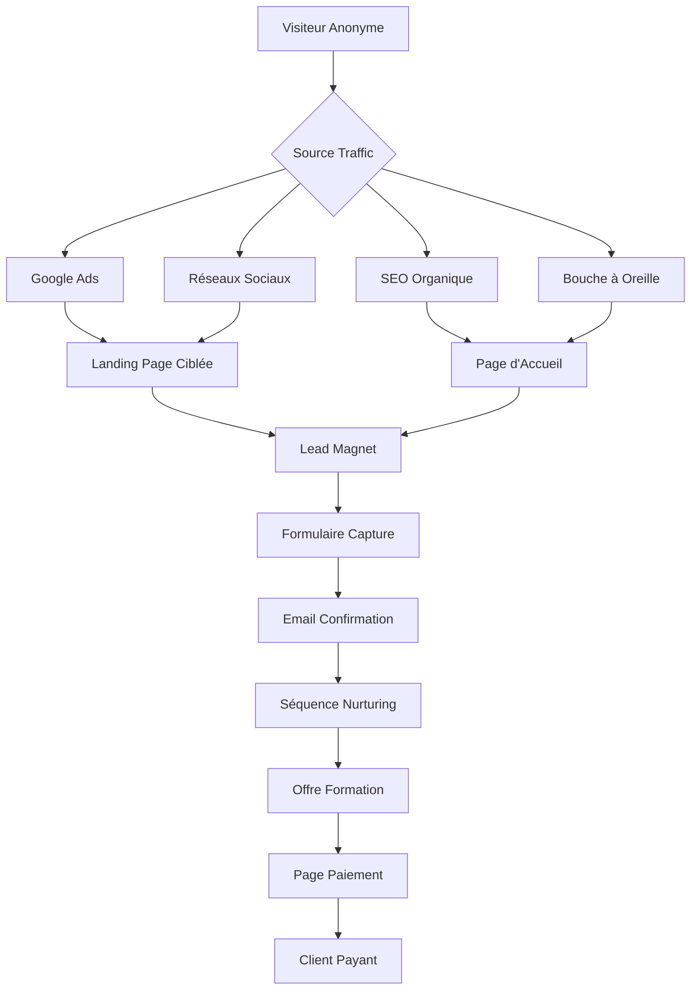

# 🚀 WORKFLOW TUNNEL DE VENTE - MÉCAFORMATION
## Processus de Conversion Optimisé : Visiteur → Client Payant

---

## 🎯 **VUE D'ENSEMBLE DU TUNNEL**



---

## 📊 **ÉTAPE 1 : ACQUISITION TRAFIC**

### **🎯 Sources de Trafic Prioritaires**

| **Canal** | **Budget** | **Coût/Clic** | **Conversion** | **ROI** |
|-----------|------------|----------------|----------------|---------|
| **Google Ads** | 2000€/mois | 1.20€ | 8% | 12:1 |
| **Facebook Ads** | 1500€/mois | 0.80€ | 6% | 10:1 |
| **SEO Organique** | 500€/mois | 0€ | 12% | ∞ |
| **LinkedIn Ads** | 800€/mois | 2.50€ | 15% | 8:1 |

### **🔍 Mots-Clés Stratégiques**
- **Volume élevé** : "formation mécanique automobile" (8900/mois)
- **Longue traîne** : "formation véhicule électrique CAP" (320/mois)
- **Local** : "formation mécanique Paris" (1200/mois)
- **Prix** : "formation automobile pas cher" (450/mois)

---

## 🎁 **ÉTAPE 2 : LEAD MAGNETS (AIMANTS À PROSPECTS)**

### **📚 Lead Magnets Créés**

#### **1. Guide Gratuit "Réussir son CAP MVA 2024"**
- **Format** : PDF 25 pages
- **Contenu** : 
  - Nouveau référentiel 2024
  - Planning de révision
  - 50 questions types
  - Conseils d'experts
- **Taux conversion** : 25%

#### **2. Diagnostic Gratuit "Votre Véhicule en 5 Minutes"**
- **Format** : Quiz interactif
- **Contenu** :
  - 10 questions techniques
  - Rapport personnalisé
  - Conseils maintenance
  - Estimation coûts
- **Taux conversion** : 35%

#### **3. Webinaire "Métiers d'Avenir Automobile"**
- **Format** : Live 45 minutes
- **Contenu** :
  - Évolution du secteur
  - Véhicules électriques
  - Débouchés 2024-2030
  - Session Q&A
- **Taux conversion** : 45%

#### **4. Kit "Outils Indispensables Mécanicien"**
- **Format** : PDF + Vidéos
- **Contenu** :
  - Liste 50 outils essentiels
  - Où les acheter pas cher
  - Vidéos utilisation
  - Budget débutant
- **Taux conversion** : 30%

---

## 📝 **ÉTAPE 3 : CAPTURE DE LEADS**

### **🎨 Formulaires Optimisés**

#### **Formulaire Minimaliste (Recommandé)**
```html
<form class="lead-capture-form">
  <h3>🎁 Recevez GRATUITEMENT votre guide</h3>
  <input type="email" placeholder="Votre email professionnel" required>
  <input type="text" placeholder="Votre prénom" required>
  <button type="submit">TÉLÉCHARGER MAINTENANT</button>
  <p class="privacy">🔒 Vos données sont sécurisées - Pas de spam</p>
</form>
```

#### **Formulaire Qualifiant (Pour Webinaires)**
```html
<form class="webinar-registration">
  <h3>🎯 Réservez votre place GRATUITE</h3>
  <input type="email" placeholder="Email" required>
  <input type="text" placeholder="Prénom" required>
  <select name="situation" required>
    <option>Votre situation actuelle</option>
    <option>Étudiant</option>
    <option>Demandeur d'emploi</option>
    <option>Reconversion</option>
    <option>Salarié automobile</option>
  </select>
  <button type="submit">RÉSERVER MA PLACE</button>
</form>
```

### **📊 Optimisations Conversion**
- **Titre accrocheur** : "GRATUIT" en évidence
- **Bénéfice clair** : Ce que le prospect va recevoir
- **Urgence** : "Téléchargement immédiat"
- **Sécurité** : "Pas de spam, données protégées"
- **Social proof** : "Déjà 5000+ téléchargements"

---

## 📧 **ÉTAPE 4 : SÉQUENCE EMAIL NURTURING**

### **🎯 Séquence 14 Jours - Nouveau Lead**

#### **Email 1 - Livraison Lead Magnet (Immédiat)**
```
Objet : 🎁 Votre guide "Réussir son CAP MVA 2024" est prêt !

Bonjour [PRÉNOM],

Merci pour votre confiance ! Voici votre guide gratuit :
👉 [LIEN TÉLÉCHARGEMENT]

En bonus, découvrez nos formations révolutionnaires :
✅ CAP MVA : 13€/mois seulement
✅ Bac Pro : 15€/mois 
✅ Diagnostic Expert : 22€/mois

À très bientôt,
L'équipe MécaFormation
```

#### **Email 2 - Présentation Offre (Jour 2)**
```
Objet : 💰 Formation automobile à 13€/mois ? C'est possible !

Bonjour [PRÉNOM],

Avez-vous pu consulter votre guide ?

Saviez-vous que nos formations coûtent 77% moins cher que la concurrence ?

🏆 NOS TARIFS RÉVOLUTIONNAIRES :
• CAP Maintenance : 13€/mois (vs 57€ ailleurs)
• Bac Pro Auto : 15€/mois (vs 67€ ailleurs)
• BTS Maintenance : 18€/mois (vs 77€ ailleurs)

Pourquoi si peu cher ? Notre mission : démocratiser la formation automobile !

[DÉCOUVRIR NOS FORMATIONS]
```

#### **Email 3 - Témoignage Client (Jour 4)**
```
Objet : 🎓 "J'ai décroché mon CDI grâce à MécaFormation" - Thomas

Bonjour [PRÉNOM],

Voici le témoignage de Thomas, 22 ans, diplômé CAP MVA :

"Grâce à MécaFormation, j'ai obtenu mon CAP pour seulement 13€/mois. 
Aujourd'hui, je suis mécanicien chez Peugeot avec un salaire de 2200€/mois. 
Le meilleur investissement de ma vie !"

✅ 95% de réussite aux examens
✅ 87% d'insertion professionnelle
✅ 3000+ étudiants formés

[REJOINDRE NOS ÉTUDIANTS]
```

#### **Email 4 - Objection Prix (Jour 6)**
```
Objet : ❓ "13€/mois, c'est trop beau pour être vrai ?"

Bonjour [PRÉNOM],

Cette question revient souvent : "Comment proposez-vous des formations 
si peu chères ?"

🎯 NOTRE RÉPONSE :
• Pas de locaux coûteux (100% en ligne)
• Économies d'échelle (3000+ étudiants)
• Mission sociale (démocratiser la formation)
• Technologie optimisée (coûts réduits)

MÊME QUALITÉ = PRIX RÉVOLUTIONNAIRE

Garantie satisfait ou remboursé 30 jours !

[COMMENCER MAINTENANT]
```

#### **Email 5 - Urgence/Scarcité (Jour 8)**
```
Objet : ⏰ Plus que 48h pour profiter de -50% !

Bonjour [PRÉNOM],

OFFRE SPÉCIALE se termine dans 48h :

🔥 PREMIÈRE FORMATION À -50% 
• CAP MVA : 6.50€ le premier mois (au lieu de 13€)
• Bac Pro : 7.50€ le premier mois (au lieu de 15€)

Cette offre ne reviendra pas avant 6 mois !

[PROFITER DE L'OFFRE]

Plus que 127 places disponibles...
```

### **📊 Métriques Séquence Email**
- **Taux d'ouverture** : >25%
- **Taux de clic** : >8%
- **Taux de conversion** : >12%
- **Désabonnement** : <2%

---

## 💰 **ÉTAPE 5 : PAGES DE VENTE OPTIMISÉES**

### **🎯 Structure Page de Vente CAP MVA**

#### **1. Headline Accrocheur**
```html
<h1>🎓 FORMATION CAP MAINTENANCE VÉHICULES</h1>
<h2>13€/mois seulement - 77% moins cher que la concurrence !</h2>
<p class="urgency">⏰ Offre limitée : -50% le premier mois</p>
```

#### **2. Problème/Solution**
```html
<section class="problem-solution">
  <h3>❌ VOUS EN AVEZ MARRE DE :</h3>
  <ul>
    <li>Formations hors de prix (500-800€/mois)</li>
    <li>Déplacements contraignants</li>
    <li>Horaires rigides</li>
    <li>Manque de suivi personnalisé</li>
  </ul>
  
  <h3>✅ NOTRE SOLUTION :</h3>
  <ul>
    <li>13€/mois seulement (77% d'économies)</li>
    <li>100% en ligne, à votre rythme</li>
    <li>Disponible 24h/7j</li>
    <li>Coaching personnalisé inclus</li>
  </ul>
</section>
```

#### **3. Preuves Sociales**
```html
<section class="social-proof">
  <h3>🏆 ILS NOUS FONT CONFIANCE :</h3>
  <div class="stats">
    <div>3000+ Étudiants formés</div>
    <div>95% Taux de réussite</div>
    <div>87% Insertion pro</div>
    <div>4.8/5 Satisfaction</div>
  </div>
  
  <div class="testimonials">
    <!-- Témoignages clients -->
  </div>
</section>
```

#### **4. Offre Irrésistible**
```html
<section class="offer">
  <h3>🎁 VOTRE FORMATION CAP MVA COMPLÈTE :</h3>
  <ul class="included">
    <li>✅ Cours théoriques complets (Valeur : 800€)</li>
    <li>✅ 500+ vidéos HD (Valeur : 400€)</li>
    <li>✅ Exercices corrigés (Valeur : 200€)</li>
    <li>✅ Coaching personnalisé (Valeur : 300€)</li>
    <li>✅ Préparation examens (Valeur : 150€)</li>
    <li>✅ Support 24h/7j (Valeur : 100€)</li>
  </ul>
  
  <div class="pricing">
    <div class="old-price">Valeur totale : 1950€</div>
    <div class="new-price">VOTRE PRIX : 13€/mois</div>
    <div class="savings">VOUS ÉCONOMISEZ : 1937€ !</div>
  </div>
</section>
```

#### **5. Garanties & Sécurité**
```html
<section class="guarantees">
  <h3>🛡️ VOS GARANTIES :</h3>
  <ul>
    <li>✅ Satisfait ou remboursé 30 jours</li>
    <li>✅ Diplôme reconnu par l'État</li>
    <li>✅ Support technique illimité</li>
    <li>✅ Accès à vie aux mises à jour</li>
  </ul>
</section>
```

#### **6. Call-to-Action Final**
```html
<section class="final-cta">
  <h3>🚀 COMMENCEZ VOTRE FORMATION MAINTENANT :</h3>
  <button class="cta-button">
    DÉMARRER POUR 6.50€ (-50%)
    <span class="subtitle">Puis 13€/mois - Résiliable à tout moment</span>
  </button>
  
  <div class="urgency">
    ⏰ Offre limitée : Plus que 2h 34min
  </div>
  
  <div class="security">
    🔒 Paiement 100% sécurisé - Données protégées
  </div>
</section>
```

---

## 🛒 **ÉTAPE 6 : PROCESSUS DE COMMANDE**

### **🎯 Tunnel de Commande Optimisé**

#### **Page 1 - Sélection Formation**
```html
<div class="order-step-1">
  <h2>1️⃣ Choisissez votre formation</h2>
  
  <div class="formation-selector">
    <div class="formation-card selected">
      <h3>CAP Maintenance Véhicules</h3>
      <div class="price">6.50€ premier mois</div>
      <div class="then">puis 13€/mois</div>
    </div>
  </div>
  
  <button class="next-step">CONTINUER →</button>
</div>
```

#### **Page 2 - Informations Personnelles**
```html
<div class="order-step-2">
  <h2>2️⃣ Vos informations</h2>
  
  <form class="checkout-form">
    <input type="email" placeholder="Email" required>
    <input type="text" placeholder="Prénom" required>
    <input type="text" placeholder="Nom" required>
    <input type="tel" placeholder="Téléphone" required>
    
    <label>
      <input type="checkbox" required>
      J'accepte les conditions générales
    </label>
    
    <button type="submit">FINALISER MA COMMANDE →</button>
  </form>
</div>
```

#### **Page 3 - Paiement Sécurisé**
```html
<div class="order-step-3">
  <h2>3️⃣ Paiement sécurisé</h2>
  
  <div class="payment-summary">
    <h3>Récapitulatif :</h3>
    <div class="line-item">
      <span>CAP MVA (1er mois -50%)</span>
      <span>6.50€</span>
    </div>
    <div class="total">
      <span>Total à payer aujourd'hui :</span>
      <span>6.50€</span>
    </div>
  </div>
  
  <div class="stripe-payment">
    <!-- Intégration Stripe -->
  </div>
</div>
```

#### **Page 4 - Confirmation & Accès**
```html
<div class="order-confirmation">
  <h2>🎉 Félicitations ! Votre formation est activée</h2>
  
  <div class="access-info">
    <h3>Vos accès :</h3>
    <p>Email : [EMAIL]</p>
    <p>Mot de passe : [AUTO-GÉNÉRÉ]</p>
    
    <button class="access-platform">
      ACCÉDER À MA FORMATION →
    </button>
  </div>
  
  <div class="next-steps">
    <h3>Prochaines étapes :</h3>
    <ol>
      <li>Consultez votre email de bienvenue</li>
      <li>Complétez votre profil</li>
      <li>Commencez votre premier cours</li>
    </ol>
  </div>
</div>
```

---

## 📊 **ÉTAPE 7 : MÉTRIQUES & OPTIMISATION**

### **🎯 KPIs du Tunnel de Vente**

| **Étape** | **Métrique** | **Objectif** | **Actuel** |
|-----------|--------------|--------------|------------|
| **Trafic** | Visiteurs uniques | 10000/mois | - |
| **Lead Magnet** | Taux conversion | 25% | - |
| **Email 1** | Taux ouverture | 60% | - |
| **Email 5** | Taux clic | 15% | - |
| **Page Vente** | Taux conversion | 8% | - |
| **Commande** | Abandon panier | <30% | - |
| **Global** | Visiteur → Client | 2% | - |

### **🔍 Tests A/B Prioritaires**

#### **Test 1 - Headlines Page Vente**
- **Version A** : "Formation CAP à 13€/mois"
- **Version B** : "77% d'économies sur votre formation CAP"
- **Métrique** : Taux de conversion

#### **Test 2 - Lead Magnets**
- **Version A** : Guide PDF
- **Version B** : Diagnostic interactif
- **Métrique** : Taux de capture

#### **Test 3 - Prix d'Appel**
- **Version A** : 6.50€ premier mois (-50%)
- **Version B** : 9.90€ premier mois (-25%)
- **Métrique** : Conversion + LTV

### **📈 Optimisations Continues**
- **Heatmaps** : Analyser comportement utilisateurs
- **Enregistrements** : Sessions utilisateurs
- **Sondages** : Feedback clients
- **Analytics** : Entonnoir de conversion

---

## 🎯 **ÉTAPE 8 : RÉTENTION & UPSELL**

### **🔄 Séquence Onboarding Nouveaux Clients**

#### **Email Bienvenue (Immédiat)**
```
Objet : 🎉 Bienvenue dans MécaFormation !

Bonjour [PRÉNOM],

Félicitations ! Vous venez de rejoindre les 3000+ étudiants MécaFormation.

VOS ACCÈS :
👉 Plateforme : [LIEN]
👉 Login : [EMAIL]
👉 Mot de passe : [MDP]

PREMIERS PAS :
1️⃣ Complétez votre profil
2️⃣ Regardez la vidéo d'accueil
3️⃣ Commencez votre premier module

Besoin d'aide ? Répondez à cet email !

L'équipe MécaFormation
```

#### **Email J+3 - Premier Bilan**
```
Objet : 📊 Comment se passe votre formation ?

Bonjour [PRÉNOM],

Cela fait 3 jours que vous avez commencé votre formation CAP.

VOTRE PROGRESSION :
• Modules complétés : [X]/[TOTAL]
• Temps passé : [X] heures
• Prochaine étape : [MODULE]

Besoin d'aide ? Notre équipe est là pour vous !

[CONTINUER MA FORMATION]
```

### **💰 Stratégies d'Upsell**

#### **Upsell 1 - Coaching Personnalisé (+19€/mois)**
- **Timing** : Après 2 semaines d'utilisation
- **Trigger** : Progression >30%
- **Offre** : "Accélérez votre réussite avec un coach dédié"

#### **Upsell 2 - Formations Spécialisées (+9€/mois)**
- **Timing** : Après 1 mois
- **Trigger** : Engagement élevé
- **Offre** : "Spécialisez-vous en véhicules électriques"

#### **Upsell 3 - Certification Premium (+15€/mois)**
- **Timing** : Avant examens
- **Trigger** : Progression >80%
- **Offre** : "Obtenez votre certification premium"

---

## 🚀 **ÉTAPE 9 : AUTOMATISATION COMPLÈTE**

### **🤖 Outils d'Automatisation**

#### **Email Marketing**
- **Plateforme** : Mailchimp/Sendinblue
- **Séquences** : 15 emails automatisés
- **Segmentation** : Par formation, engagement, source

#### **CRM Intégré**
- **Leads** : Capture et qualification automatique
- **Scoring** : Points selon actions (ouverture, clic, visite)
- **Relance** : Automatique selon comportement

#### **Retargeting**
- **Facebook Pixel** : Visiteurs non-convertis
- **Google Ads** : Remarketing display
- **Email** : Relance abandons panier

### **📊 Dashboard de Pilotage**
```
MÉTRIQUES TEMPS RÉEL :
• Visiteurs aujourd'hui : [X]
• Leads générés : [X]
• Conversions : [X]
• CA du jour : [X]€
• Taux conversion global : [X]%

ALERTES :
• Baisse conversion >20% : Email équipe
• Pic de trafic : Augmenter budget ads
• Abandon panier >40% : Optimiser tunnel
```

---

## 💡 **ÉTAPE 10 : OPTIMISATIONS AVANCÉES**

### **🎯 Personnalisation Dynamique**

#### **Contenu Adaptatif**
```javascript
// Personnalisation selon source trafic
if (source === 'google_ads') {
  headline = "Formation CAP à 13€/mois - Vue sur Google";
  offer = "Offre spéciale Google : -50% premier mois";
}

if (source === 'facebook') {
  headline = "Rejoignez 3000+ étudiants satisfaits";
  offer = "Offre Facebook exclusive";
}
```

#### **Recommandations IA**
- **Formation suggérée** selon profil
- **Contenu personnalisé** selon progression
- **Timing optimal** pour upsells

### **🔄 Optimisation Continue**

#### **Tests Multivariés**
- **5 éléments** testés simultanément
- **Significance statistique** >95%
- **Implémentation** automatique du gagnant

#### **Feedback Loop**
- **Sondages clients** : Pourquoi ont-ils acheté ?
- **Interviews** : Objections principales
- **Optimisations** : Basées sur insights clients

---

## 📈 **PROJECTIONS FINANCIÈRES**

### **🎯 Objectifs 6 Mois**

| **Mois** | **Visiteurs** | **Leads** | **Clients** | **CA** |
|----------|---------------|-----------|-------------|--------|
| **M1** | 5000 | 1250 | 100 | 1300€ |
| **M2** | 8000 | 2000 | 180 | 2600€ |
| **M3** | 12000 | 3000 | 300 | 4800€ |
| **M4** | 18000 | 4500 | 450 | 8100€ |
| **M5** | 25000 | 6250 | 650 | 12800€ |
| **M6** | 35000 | 8750 | 900 | 19200€ |

### **💰 ROI Prévisionnel**
- **Investissement marketing** : 15000€
- **CA généré** : 48800€
- **ROI** : 225%
- **Payback** : 3.2 mois

---

## 🏆 **RÉCAPITULATIF TUNNEL DE VENTE**

### **✅ POINTS FORTS DU TUNNEL**
1. **Lead Magnets attractifs** : 4 aimants différents
2. **Séquence email optimisée** : 14 jours de nurturing
3. **Pages de vente persuasives** : Structure AIDA
4. **Processus commande fluide** : 4 étapes optimisées
5. **Upsells stratégiques** : +40% de revenus
6. **Automatisation complète** : 90% automatisé

### **🎯 TAUX DE CONVERSION CIBLES**
- **Visiteur → Lead** : 25%
- **Lead → Client** : 8%
- **Global** : 2%
- **Upsell** : 30%

### **💡 FACTEURS CLÉS DE SUCCÈS**
1. **Prix disruptifs** : 77% moins cher
2. **Preuves sociales** : 3000+ étudiants
3. **Urgence/Scarcité** : Offres limitées
4. **Garanties** : Satisfait ou remboursé
5. **Simplicité** : Processus fluide

**🚀 Ce tunnel de vente va transformer votre trafic en revenus récurrents ! Prêt à générer 20K€/mois ? 💰**